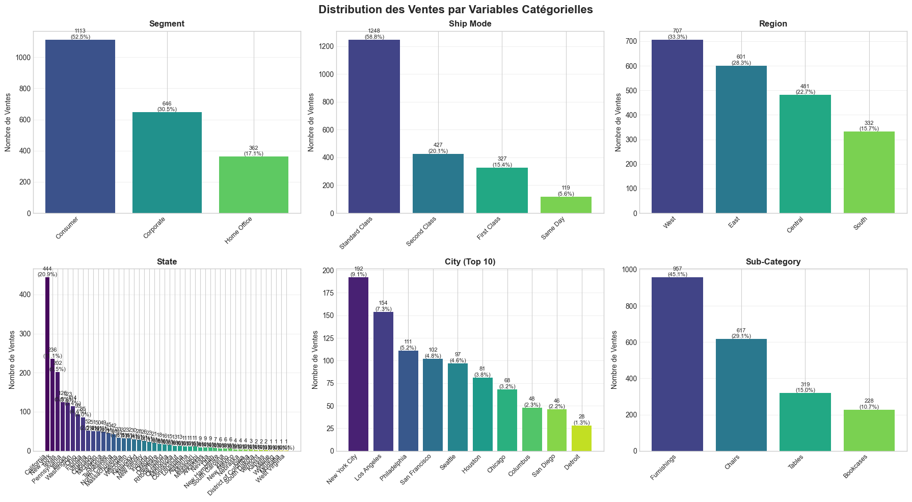
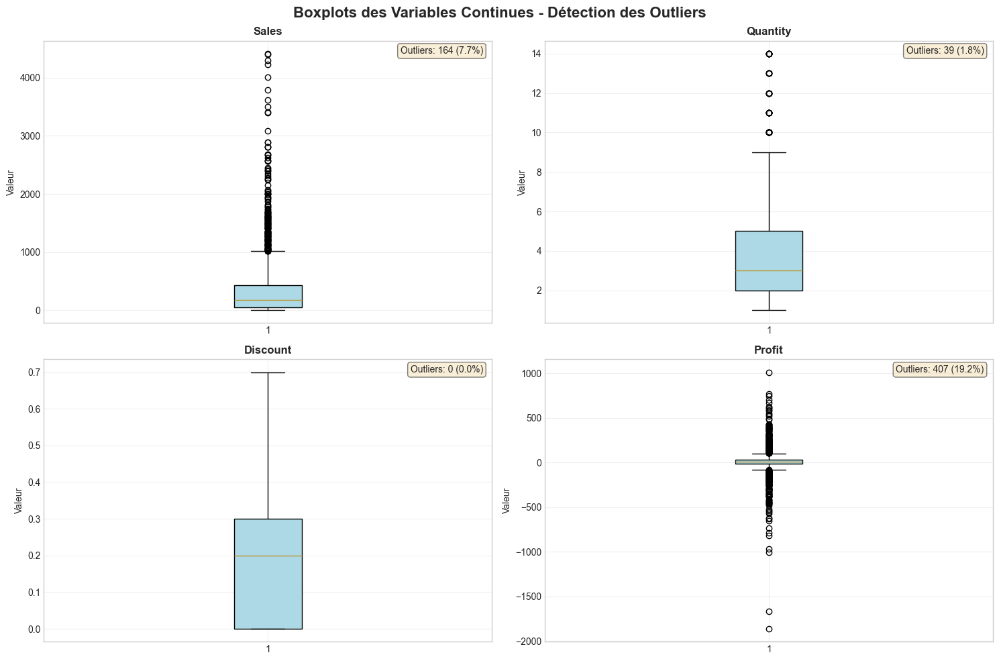
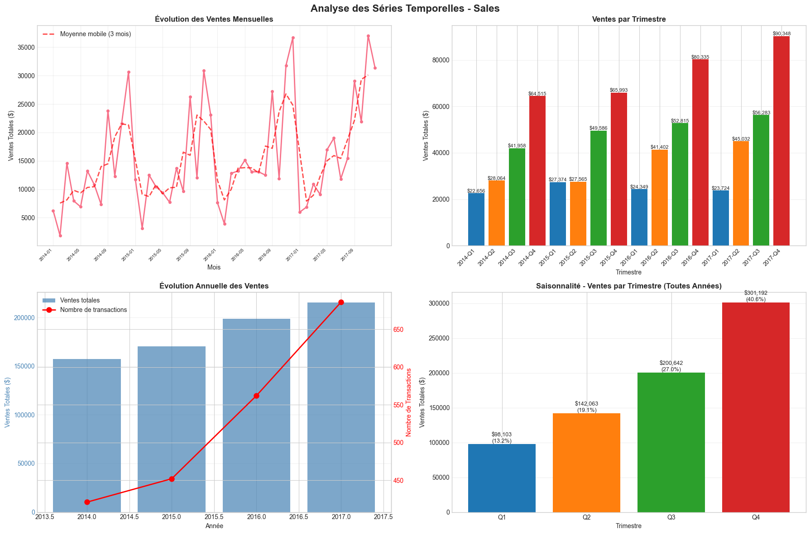
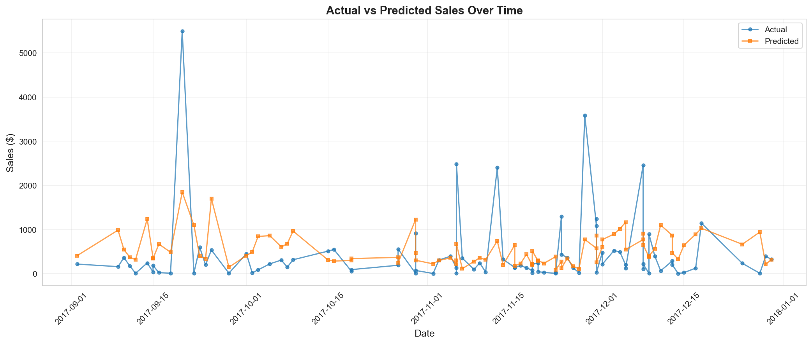
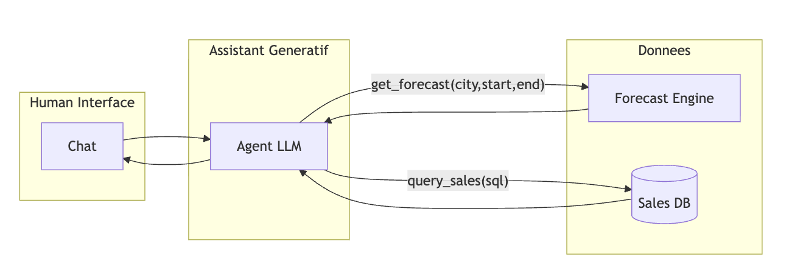
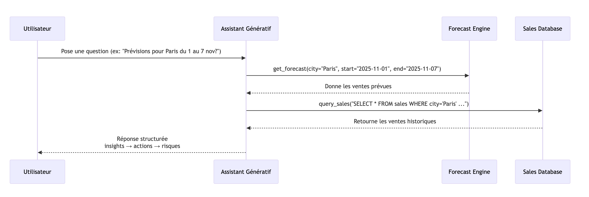

# Réponses

Avant toute chose, on va faire préciser la tâche en fonction des données disponibles: on va essayer de prédire les ventes par **ville** et par **jour**.

- Par ville car on n'a pas de données par magasin
- Par jour: l'horizon de forecast dépend du use-case, on va supposer qu'on souhaite faire du short-term forecasting avec pour use-case du management de staff et du planning d'inventaire immédiat. Cela donne aussi en général de meilleurs résulats.

## Question 1 : Préparation des données

### Qualité des données

On réfère le reviewer au [DATA_DICTIONARY.md](DATA_DICTIONARY.md)   pour la documentation de chaque champ.

Les 3 principaux problèmes liés à la qualité de données sont:

- **Données manquantes**:

  Les données sont complètes et il n'y a pas de doublons de order/produit. Cependant, les ROW ID ne sont pas consécutifs, ce qui indique potentiellement que le dataset a été filtré ou des données ont été perdues. Cela pourrait affecter la capacité du modèle à généraliser si les données en production sont issues d'une distribution différente (e.g. pas seulement les ventes de "Furniture"). Il n'y a pas vraiment de mitigation possible dans l'immédiat, à part communiquer cette limitation aux utilisateurs et monitorer la distribution des features en production.

- **Déséquilibre des champs**:



  Comme souvent dans ce genre de dataset, les différents features ne sont pas uniformes, e.g. il y a plus de commandes à NY qu'à Détroit. Cela veut dire qu'on aura une meilleure performance pour prédire les commandes à NY qu'à Détroit car plus de données historiques. Cela peut être mitigé soit par du oversampling, soit par le choix d'un algorithme moins sensible à ce déséquilibre (e.g. random forest). La mitigation "ultime" reste de collecter plus de données sur les villes sous-représentées. On peut cependant faire l'hypothèque que d'un ppoint de vue business, ces ville sont moins importantes car sources de moins de revenu.

- **Outliers**:



Certains champs comportent des outliers notables (e.g. ~7% des ventes très hautes). Cela peut biaiser l'entraînement et "écraser" les autres valeurs. On peut mitiger ce problème en cappant les outliers (i.e. utiliser un valeur min/max comme seuil) et en choisissant un algo peu sensible aux outliers (e.g. random forest)

### Choix des features

L'EDA montre une claire saisonnalité et une tendance de croissance.



On va donc utiliser la variable de prédiction elle-même et ses variations comme prédicteur de sa valeur future. Des des marqueurs temporels peuvent aussi être utiles pour capturer des variations saisonnières.

Plus précisément:

- Marqueurs de jour / semaine / mois / trimestre / weekend
- Historiques de ventes:
  - Valeurs des N jour(s) précédent: lag_1 (valeur de la veille), lag_7, lag_14
  - Moyenne et Variance sur les N derniers jours: rollmean_7, rollmean_28, rollstd_7, rollstd_28

On va se contenter de ces features pour ce travail mais on pourrait include des features catégoriques et continus tels que Discount ou Profit dans de futures itérations.

## Question 2 : Insights et interprétation

Comme mentionné en préembule, on se concentre sur faire des prédictions par ville et par jour.

On peut imaginer comme utilisateurs:

1. Principal persona: Logistique. Ils peuvent utiliser l'outil pour ajuster l'offre (stocks, resources)
2. Persona secondaire: Marketing. Ils peuvent utiliser l'outil pour voir l'effet de discount sur un période donnée, par catégorie (e.g. ville mais aussi segment/sub-segment)

Par exemple, les résultats de feature importance montrent que rollmean_7 (43%), lag_1 (15%) et lag_7 (11%) sont les principaux conributeurs de variance. Cela signifie que les ventes du lendemain sont grandement prévisibles à partir des ventes de la semaine passée. Donc si on voit un rollmean_7 élevé, on peut encourager un investissement marketing (e.g. cross-sell ou upsell) pendant que la demande est élevée.

## Question 3: Solution ML

On a choisi un Random Forest, qui entraîne un ensemble d'arbres de décisions indépendants sur des sous-échantillons du dataset.

**Avantages**:

- Peu sensible aux outliers et au bruit
- Accepte les features temporels out-of-the-box
- **Interprétable**: on récupère la contribution de chaque feature out-of-the-box, très utile pour comprendre ce qui influence les ventes.
- Bonne baseline de performance et facile et rapide à entrainer

**Inconvénients**:

- Ne peut pas extrapoler au-delà des données d'entraînement, e.g. si hausse soudaine de ventes. Peut-être mitigé avec incorporation explicite de feature marquant des changements (comme les changepoints de Prophet). On voit bien cette limite dans les résultats sur les hausses soudaines.

- Pas d'intervalle de confiance autour de la prédiction ("point estimate"). La variance des arbres est un proxy mais pas une vraie estimation d'intervale statistique.
- Risque d'overfit si on permet trop de profondeur. On peut mitiger en fixant max_depth pas trop haut et min_samples_leaf pas trop bas.

Une alternative similaire aurait été un XGBoost mais le dataset est un peu petit (risque d'overfit) et l'interprétabilité moins claire (estimée avec des valeurs SHAP en général)

## Question 4: Dégradation de performance

Une raison de dégradation de performance est le **data drift**: la distribution des variables d'entrée change, e.g. le discount augmente, le mix de produits change ou de nouvelles villes apparaissent.
Le meilleur moyen de mitiger ce problème est de **ré-entraîner le modèle sur des données récentes**. Idéalement on ré-entraîne tous les jours vu que les ventes du jour d'avant sont un feature important de prédiction.

## Question 5: Intégration de l'IA générative

On pourrait intégrer de l'IA générative comme interface conversationelle qui permettrait à des utilisateurs de poser des questions aux données et prédictions. Cela servirait comme une couche de traduction/vulgarisation, en convertissant une requête en langage naturel vers du code (SQL ou requête à une api) ou puis de nouveau vers du langage naturel.

Architecture possible:




**Considérations**

- En pratique, on n'utiliserait sûrement pas le prediction engine directement mais les prédictions de la DB directement si elles existent.
- Il est crucial de limiter le scope et les premissions de l'agent pour éviter des enjeux de sécurités. Par exemple, ne lui donner qu'un "accès lecture" à une table unique (sales).
- En production, on aurait aussi des guardrails appliqués sur les requêtes utilisateur pour détecter des mauvais usages (e.g. couches de modération)
- On pourrait aussi utiliser un serveur MCP comme interface unique avec l'agent vers la DB et les apis.

System Prompt:

```
Tu es l’assistant de ventes de SuperStore Inc.
Ta mission est d’aider les utilisateurs à analyser, comprendre et anticiper les ventes, en combinant données historiques et prévisions.

Outils disponibles :
- get_forecast(city, start, end) → renvoie les ventes prévues sur une période donnée (par ville).
- query_sales(sql: str) → exécute une requête SQL sur la base de données de ventes (données historiques).

Règles de réponse :
- Réponds en français clair, concis et professionnel.
- Cite les chiffres quand c’est possible (valeurs, périodes, villes, unités).
- Si une donnée est manquante ou incertaine, explique-le explicitement.
- Préfère les formulations explicites (“les ventes devraient augmenter de +12 % à Lyon”) à des généralités.
- Utilise un ton factuel, orienté décision (pas spéculatif).
- Si l'utilisateur pose une question hors de ce context précis, dis que tu ne peux pas les aider et propose leur une question à laquelle tu peux répondre.

Termine, si pertinent, par une phrase de synthèse (ex. “En résumé, la dynamique hebdomadaire reste favorable à court terme à Lyon.”)
```

Exemple de prompt utilisateur:

```
Compare les ventes prévues et historiques à New York sur les deux prochaines semaines.
```
